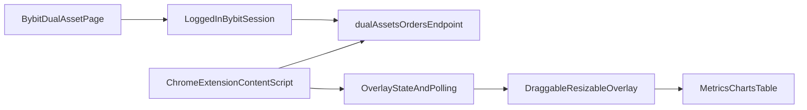

# Bybit Dual Asset Extension Rewrite Plan

**Goal:** Rebuild the dashboard as a draggable, minimizable, resizable overlay on top of Bybit’s Dual Asset orders page, using Bybit’s in-page authenticated data source instead of our own backend/API route.

**Target page:** `https://www.bybit.com/user/assets/order/financial/financial-dual-asset-orders/dual-asset-order`

**Primary data source:** `POST https://www.bybit.com/x-api/s1/byfi/dual-assets/orders`

**V1 scope decision:** Use only the `dual-assets/orders` endpoint for the first version. Do not depend on HTML scraping or secondary detail endpoints in v1.

---

## Current App Reference

Use the existing dashboard as the behavioral and UX reference for “same as here”:

- [src/components/Dashboard.tsx](src/components/Dashboard.tsx): current cards, charts, table, countdown, and summary behavior
- [src/lib/dataService.ts](src/lib/dataService.ts): current `DualAssetTransaction` shape and derived metrics logic
- [src/app/api/bybit/earn/route.ts](src/app/api/bybit/earn/route.ts): old API-based transport that will be removed from the new architecture
- [docs/plans/2026-03-10-bybit-dual-asset-api-research.md](docs/plans/2026-03-10-bybit-dual-asset-api-research.md): historical API research that becomes background context only

The rewrite should preserve the dashboard’s useful outcomes, but the new source of truth is the Bybit page endpoint rather than our server route.

---

## V1 Architecture

### Extension model

- Content script runs only on the Bybit Dual Asset orders page.
- It injects an overlay root into the page.
- The overlay contains the dashboard UI and a small local state store.
- Data is fetched directly from Bybit using the user’s existing authenticated browser session on the page.
- No local Next.js API route, no `.env` keys, and no Bybit SDK are needed for the new runtime path.

### Overlay behavior

- Draggable floating window
- Resizable panel
- Minimize / restore
- Persistent position and size in extension storage
- Safe default placement so it does not block core Bybit actions on first load

---

## Canonical Data Model For The New Dashboard

Create the new dashboard data model from this endpoint response first, then build the UI from that normalized shape.

### Raw fields to preserve from Bybit

From each `dual_assets_orders` row, keep these raw source fields available in the normalized record or debug metadata:

- `order_id`
- `id`
- `product_name`
- `created_at`
- `apply_end_at`
- `yield_start_at`
- `yield_end_at`
- `estimate_yield_distribution`
- `order_status`
- `order_status_v3`
- `status`
- `order_direction`
- `coin`
- `return_coin`
- `coin_x`
- `coin_y`
- `total_locked_amount_e8`
- `cumulate_pnl_e8`
- `apy_e8`
- `settled_apy_e8`
- `benchmark_price_e8`
- `settlement_price_e8`
- `settlement_time`
- `duration`
- `yield_duration`
- `order_type`
- `account_type`
- `to_account_type`
- `order_mode`
- `rfq_expire_time`

### Normalized dashboard fields to produce

Keep the dashboard centered around a normalized transaction/order model equivalent to the current app’s needs:

- `orderId`
- `productName`
- `baseAsset`
- `quoteAsset`
- `investmentToken`
- `investmentAmount`
- `orderDirection` as `Buy Low` or `Sell High`
- `targetPrice`
- `apr`
- `settledApr`
- `orderTime`
- `settlementTime`
- `yieldStartTime`
- `yieldEndTime`
- `estimatedDistributionTime`
- `stakingPeriodLabel`
- `yieldDurationDays`
- `status` as `Active` or `Completed`
- `settlementPrice`
- `proceeds`
- `proceedsToken`
- `profitAmount`
- `profitToken`
- `winOrLoss`
- `realApr`
- `countdownLabel`
- `sourceRaw` for debugging

### Expected field derivations from the sample payload

- Parse `product_name` like `SOL-USDT 8h` or `SOL-USDT` into pair metadata and optional tenor label.
- Convert `_e8` numeric strings into display values.
- Map coin ids using `coin`, `coin_x`, `coin_y`, and `return_coin` into token symbols.
- Map `order_direction=1` to `Buy Low`, `order_direction=2` to `Sell High`.
- Treat `order_status_v3=2` as active/pending and `order_status_v3=3` as completed, unless later payload evidence disproves this.
- Use `benchmark_price_e8` as target price.
- Use `settlement_price_e8` as settlement price when non-zero.
- Use `total_locked_amount_e8` as principal/investment amount.
- Use `cumulate_pnl_e8` as the total payout/proceeds figure currently exposed by Bybit for settled rows.
- Derive `profitAmount`, `winOrLoss`, and `realApr` using the same high-level semantics the current dashboard already applies.

---

## Dashboard Features To Preserve In V1

Rebuild these current dashboard outcomes on top of the new data source:

- Total profit summary
- Win rate / conversion ratio
- VWAP-style target price summary by product and direction
- Consolidated profit timeline chart
- Dual Asset transactions table
- Live countdown for active orders

Adjust labels only where the new Bybit-native payload lets us be more accurate.

---

## Rewrite Strategy

## Execution In Parts

Work this plan in small, reviewable parts. At the end of each part:

- Review the result against the plan
- Decide whether any follow-up fixes are needed before continuing
- Ask whether you want a git commit
- If you approve a commit, exclude AI planning markdown files from the commit
- Start the next part only after the current part is accepted

### Part 1: Data Spec And Normalization Contract

**Goal:** Freeze the Bybit orders payload contract and define the normalized dashboard model before rewriting runtime code.

**Status:** Completed

**Includes:**

- Write the extension data-spec markdown file
- Document field mappings, status mappings, coin mappings, and `_e8` conversions
- Mark which fields are raw, derived, or heuristic
- Define the normalized TypeScript shape the overlay will consume

**Exit criteria:**

- The markdown spec is complete enough to implement against without guessing
- The dashboard field list is explicitly tied to the `dual-assets/orders` payload

**Commit checkpoint:** If approved, this is a good point for a documentation-only commit.

### Part 2: Extension Runtime Skeleton

**Goal:** Replace the old app runtime direction with an extension-first shell that can mount on the Bybit page.

**Status:** Completed

**Includes:**

- Add the Chrome extension manifest and entry points
- Add content-script bootstrapping for the Bybit Dual Asset page
- Add overlay mount/root logic
- Add draggable, minimizable, and resizable window state scaffolding
- Add extension storage for overlay preferences

**Exit criteria:**

- The extension can inject a visible overlay shell on the target Bybit page
- Overlay chrome works even before real data is wired in

**Commit checkpoint:** If approved, this is a good point for an architecture checkpoint commit.

### Part 3: Bybit Data Fetching And Transformation

**Goal:** Wire the overlay to the real Bybit `dual-assets/orders` endpoint and normalize the response into dashboard-ready records.

**Includes:**

- Implement the in-page/authenticated fetch path
- Add request payload shaping for the initial `product_type=2` flow
- Normalize `dual_assets_orders` rows into the new dashboard model
- Handle loading, empty, and error states
- Keep optional raw payload visibility only if useful for debugging

**Exit criteria:**

- The overlay renders live order data from Bybit
- Active and completed orders map correctly into the normalized model

**Commit checkpoint:** If approved, this is a good point for a data-integration commit.

### Part 4: Dashboard Port And Cutover

**Goal:** Rebuild the useful dashboard experience on top of the new extension architecture and retire the old API-based runtime path.

**Includes:**

- Port the summary cards, timeline, table, and countdown behavior
- Exclude the investment allocation chart
- Reuse existing visual/metric logic only where it still matches the new source
- Remove or archive the old API-based fetch/runtime path
- Leave the project in a clean extension-first state

**Exit criteria:**

- The extension provides the intended dashboard experience on top of the Bybit page
- Legacy API runtime code is no longer the primary path

**Commit checkpoint:** If approved, this is a good point for the main feature commit.

### Phase 1: Document and freeze the new source-of-truth model

- Create a design/data-reference markdown file dedicated to the extension rewrite.
- Record the endpoint request payload, response shape, field meanings, status mappings, and `_e8` conversion rules.
- Explicitly mark which dashboard fields are raw, derived, or still heuristic.

### Phase 2: Replace the app architecture

- Remove the old runtime dependency on [src/app/api/bybit/earn/route.ts](src/app/api/bybit/earn/route.ts).
- Remove the old fetch path in [src/lib/dataService.ts](src/lib/dataService.ts) that assumes `/api/bybit/earn`.
- Stop treating the current Next.js app as the production runtime.
- Rebuild the project around extension entry points: content script, overlay UI, extension manifest, and storage-backed overlay state.

### Phase 3: Port and adapt the dashboard UI

- Reuse the visual structure and metric logic from [src/components/Dashboard.tsx](src/components/Dashboard.tsx) where it still fits.
- Split presentational concerns from data normalization.
- Make the overlay robust against Bybit page reloads, route changes, and temporary request failures.

### Phase 4: Simplify aggressively

- Do not carry forward the old API research probes into the extension runtime.
- Do not scrape page HTML for table values in v1.
- Do not add background complexity unless content-script fetch restrictions force it.
- Keep a small debug panel or raw payload viewer only if it materially helps future field mapping.

---

## Key Unknowns To Validate During Implementation

- Whether direct fetch from the content script to Bybit’s `x-api` endpoint works cleanly with the user’s logged-in session and page origin.
- Whether the endpoint supports pagination or cursoring beyond `limit` in a way the UI needs.
- Whether additional request parameters are needed to mirror all rows visible in Bybit’s own page filters.
- Whether the extension should poll on an interval, refetch only on demand, or detect page interactions.
- Whether a coin-id lookup table is sufficient or if symbols can be inferred safely from payload fields alone.

---

## Deliverables

- A markdown data-spec file for the extension rewrite and all target dashboard data points
- A clean extension-first architecture plan
- A clear removal path for the old API-based dashboard runtime
- A v1 scope that ships the existing dashboard experience as an overlay on Bybit using the `dual-assets/orders` endpoint only
