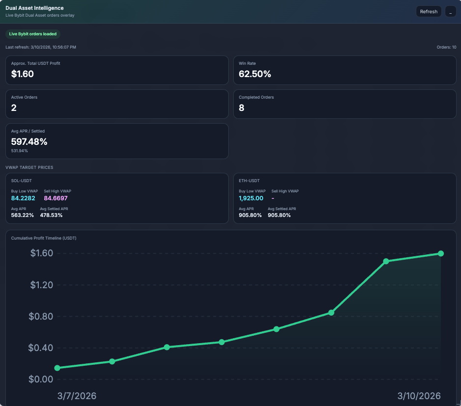
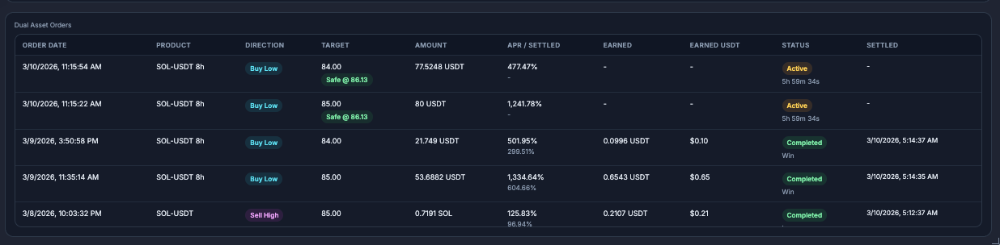

# Bybit Dual Asset Overlay Extension

A Chrome extension that injects a draggable overlay dashboard on top of Bybit's Dual Asset orders page, providing real-time analytics on your Dual Asset positions.

## Screenshots

## Installation

1. Open `chrome://extensions`
2. Enable **Developer mode**
3. Click **Load unpacked**
4. Select this `extension/` folder
5. Navigate to the target page (below) — the overlay appears automatically

## Target Page

`https://www.bybit.com/user/assets/order/financial/financial-dual-asset-orders/dual-asset-order`

You must be logged into your Bybit account. The extension uses your authenticated browser session to fetch data.

## Features

- **Summary cards** — Total USDT profit, win rate, active/completed order counts, average APR (quoted and settled)
- **VWAP target prices** — Volume-weighted average target price per product and direction (Buy Low / Sell High), with per-token average APR
- **Cumulative profit timeline** — SVG line chart showing running USDT profit across settled orders
- **Orders table** — Order date, product, direction, target price, amount, APR / settled APR, earned amount, earned USDT, status, settlement date
- **Live countdown** — Active orders show a ticking countdown to settlement (updates every second)
- **Strike price monitoring** — Active orders show whether the current market price is triggering the strike, fetched from Bybit's public spot ticker API on each refresh
- **Win/Loss tracking** — Orders where the target was hit and investment was converted to a different token are marked as Loss; same-token returns are marked as Win
- **Draggable, resizable, minimizable** — Window position and size persist across page reloads via Chrome storage
- **Refresh button** — Re-fetches orders and spot prices on demand

## Data Source

The extension calls `POST https://www.bybit.com/x-api/s1/byfi/dual-assets/orders` directly from the content script using the page's authenticated session. Spot prices for strike monitoring come from `https://api.bybit.com/v5/market/tickers`.

No API keys or backend server required.

## Architecture

- `manifest.json` — Manifest V3, content script injection, host permissions for `bybit.com` and `api.bybit.com`
- `content.js` — All logic: overlay DOM, drag/resize/minimize, data fetching, normalization, rendering
- `content.css` — Dark-themed overlay styling

